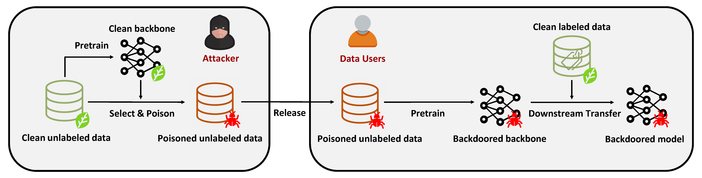

## <strong><span style="color: red;">Note: Code for ImageNet-100 is still incomplete, please wait a moment, thank you!</span></strong>

# No Label Backdoor

This is the official repository for "[How to Craft Backdoors with Unlabeled Data Alone?](https://arxiv.org/abs/2404.06694)" by Yifei Wang*, Wenhan Ma*, Stefanie Jegelka, Yisen Wang.



## Requirements

```
torch==1.10.0
torchvision==0.11.1
einops
pytorch-lightning==1.5.3
torchmetrics==0.6.0
lightning-bolts>=0.4.0
tqdm
wandb
scipy
timm
```

## Run on CIFAR-10

### Step 1:

Split training set into pretraining set and downstream set. Run
`python ./misc/cifar10_split.py`

### Step 2:

Pretrain the clean encoder on pretraining set. Run the script in `script/cifar10_encoder`

### Step 3:

Select the poison subset. Run the script in `script/cifar10_poison`

### Step 4:

Pretrain the backdoor encoder on pretraining set with poison subset. Run the script in `script/cifar10_pretrain`

### Step 5:

Train the classifier. Run the script in `script/cifar10_linear`

## Run on ImageNet-100

To be finished.

## Citation

If you find this useful in your research, please consider citing:

```
@article{wang2024craft,
  title={How to Craft Backdoors with Unlabeled Data Alone?},
  author={Wang, Yifei and Ma, Wenhan and Wang, Yisen},
  journal={arXiv preprint arXiv:2404.06694},
  year={2024}
}
```

## Acknowledgement

This repo is based upon the following repository:

* [solo-learn](https://github.com/vturrisi/solo-learn)
